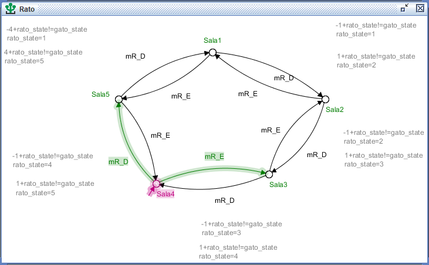

# Projeto de Controle Supervisionado

## Index
- [Descrição](#Descrição)
- [Eventos](#Eventos)
- [Autômatos](#Autômatos)
- [Supervisor](#Supervisor)
- [Requisitos](#Requisitos)
- [Execução](#Execução)
- [Autores](#Autores)
- [Licença](#Licença)

## Descrição

O sistema consiste em uma torre com 5 salas conectadas em um ciclo (Sala 1 → Sala 2 → Sala 3 → Sala 4 → Sala 5 → Sala 1). Há um gato e um rato que se movem livremente entre as salas. Sem controle:

O gato não deve entrar na sala onde o rato está. Se isso acontecer o gato irá comer o rato (ou haverá uma "colisão" ou estado perigoso). Além disso, o sistema é não bloqueante (não deve travar) e permitir o máximo de liberdade ao gato e ao rato.

## Eventos

Não controláveis: Movimentos do rato e do gato (ocorrem espontaneamente).

- move_rato_esquerda, move_rato_direita

- move_gato_esquerda, move_gato_direita

## Autômatos

Depois de definir a topologia e separar os eventos não controláveis, utilizamos o software Supremica para montar os autômatos conforme o funcionamento desejado. Ao criar o projeto, adicionamos os eventos e construímos as três plantas necessárias (Rato, Gato e Alternância). Assim, temos:

- Autômato do Rato



- Autômato do Gato


- Autômato para alternância do rato e do gato


## Supervisor

Com todas as plantas prontas e funcionando corretamente, podemos usar o software para gerar o supervisor de forma automática. Assim temos:

- Supervisor


Após sintetizar todos os autômatos a fim de obter um sistema controlável, conseguimos criar a Suprema Sub-Linguagem Controlável:

- Suprema Sub-linguagem Controlável


## Requisitos

- Java versão 8.0+: [Link para Download](https://www.java.com/pt-BR/)

- Graphviz: [Link para Download](https://www.graphviz.org/)

- Supremica IDE: [Link para Download](https://github.com/robimalik/Waters/releases/tag/v2.7.1)

## Execução

Utilize o software para simular o supervisório e verificar o correto funcionamento do sistema. Abra o arquivo Projeto1_SED.wmod no SUPREMICA, preferencialmente pelo supremica.jar. Para visualizar a simulação do supervisório:

1. Execute o arquivo "supremica.jar" dentro da pasta do Supremica:
```
supremica.jar
```

2. Com o Supremica aberto, abra o projeto "Gato&rato_v2.wmod" que se encontra na pasta source:
```
Gato&rato_v2.wmod
```

## Autores

- [André Medeiros](https://github.com/andreemedeiros)

- [João Marcelo](https://github.com/marcello-rbr)

- [Vitor Lucas](https://github.com/Vitorluca)

Contribution to the project [Print Automation](https://github.com/andreemedeiros/Supervised-Control-Project/graphs/contributors)

## Licença

Este projeto é licenciado pela MIT License - veja [LICENSE.md](LICENSE.md) para mais detalhes.
